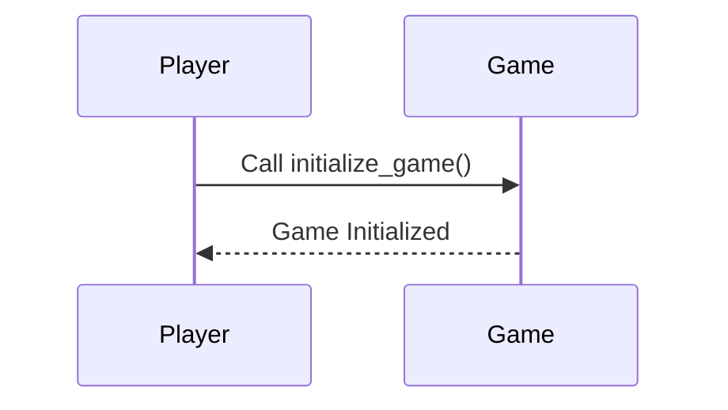
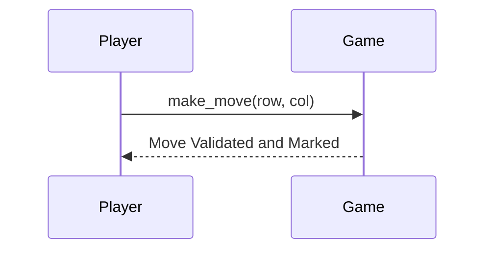
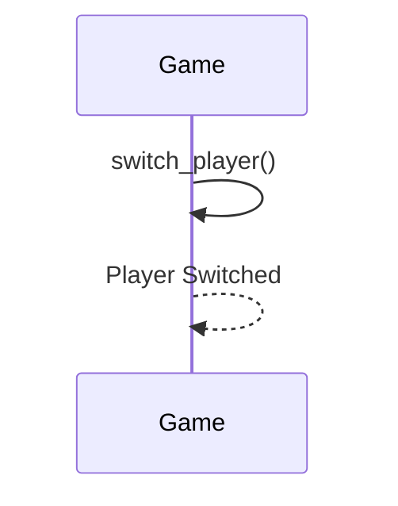
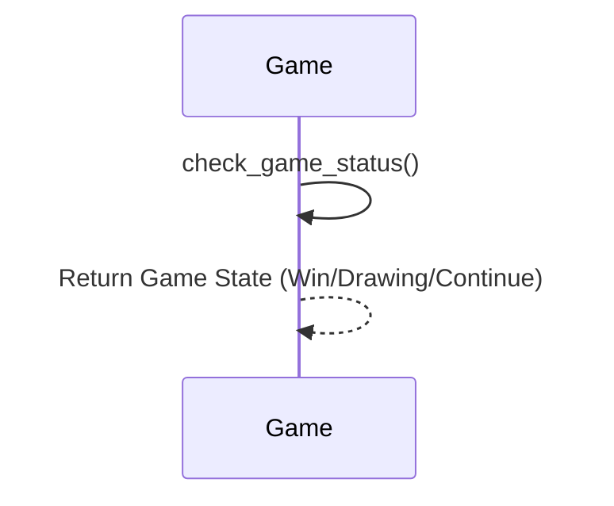
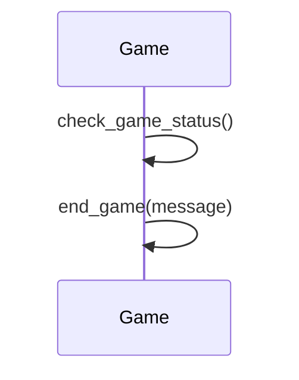
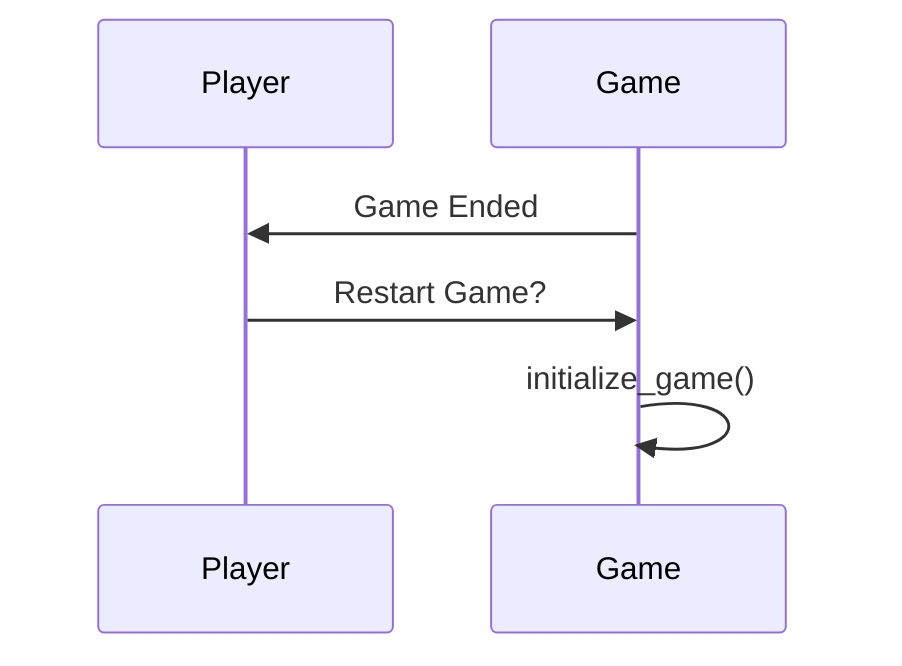

# Comprehensive Design Document: Tic Tac Toe Game Script

## 🧵 User Story 1: Setting Up the Game
### 🔹 Functional Specifications
- The script must provide a function to initialize a new game.
- The game board should start in an empty state with all cells set to a blank space " ".

### 🔧 Technical Specifications
- A function `initialize_game` will be created to reset the game state.
- The game state will include a 2D list for the board and a variable to keep track of the current player.

### 🏗 Architecture Diagrams


## 🧵 User Story 2: Displaying the Game Board
### 🔹 Functional Specifications
- The script should display the current state of the game board after each move.
- Each cell should be marked with "X", "O", or " " to represent the current state.

### 🔧 Technical Specifications
- A function `display_board` will be created to print the current board state to the console.
- The function will iterate over the 2D list representing the board and print each cell's content.

### 🏗 Architecture Diagrams
```mermaid
graph LR
    A[display_board()] --> B[Iterate over Board]
    B --> C[Print Board]
```

## 🧵 User Story 3: Making a Move
### 🔹 Functional Specifications
- The script should allow players to input a move by selecting a cell.
- The script should validate the move to ensure it is within the board's dimensions and that the selected cell is empty.

### 🔧 Technical Specifications
- A function `make_move` will be created to handle player input and validation.
- The function will check if the selected cell is empty and within the board dimensions before marking it with the player's symbol.

### 🏗 Architecture Diagrams


## 🧵 User Story 4: Switching Players
### 🔹 Functional Specifications
- After each valid move, the game should alternate turns between players.
- The script should keep track of whose turn it is and display it appropriately.

### 🔧 Technical Specifications
- A function `switch_player` will be created to toggle between players after a valid move.
- The function will update a variable tracking the current player.

### 🏗 Architecture Diagrams


## 🧵 User Story 5: Checking for a Win or Draw
### 🔹 Functional Specifications
- The script should check for a win condition after each move.
- The script should also check for a draw if all cells are filled without a win.

### 🔧 Technical Specifications
- A function `check_game_status` will be created to evaluate the game state.
- The function will check each row, column, and diagonal for a win and the board for a full state to determine a draw.

### 🏗 Architecture Diagrams


## 🧵 User Story 6: Ending the Game
### 🔹 Functional Specifications
- The game should halt further moves once a win or draw condition is met.
- The script should display an appropriate message indicating the game's conclusion.

### 🔧 Technical Specifications
- The `check_game_status` function will halt the game loop if a win or draw is detected.
- A function `end_game` will be created to print the result message and end the game loop.

### 🏗 Architecture Diagrams


## 🧵 User Story 7: Restarting the Game
### 🔹 Functional Specifications
- The script should offer the option to restart the game after it ends.
- The script should reset the game state to its initial state and allow a new game to begin.

### 🔧 Technical Specifications
- After the game ends, the script will prompt the user to restart the game.
- If the user chooses to restart, the script will call the `initialize_game` function to reset the game state.

### 🏗 Architecture Diagrams


This document outlines the functional and technical aspects of each user story, providing a clear path for the development of a simple Tic Tac Toe game script in Python. Each section is designed to guide the developers in implementing the game with detailed specifications and diagrams for clarity.